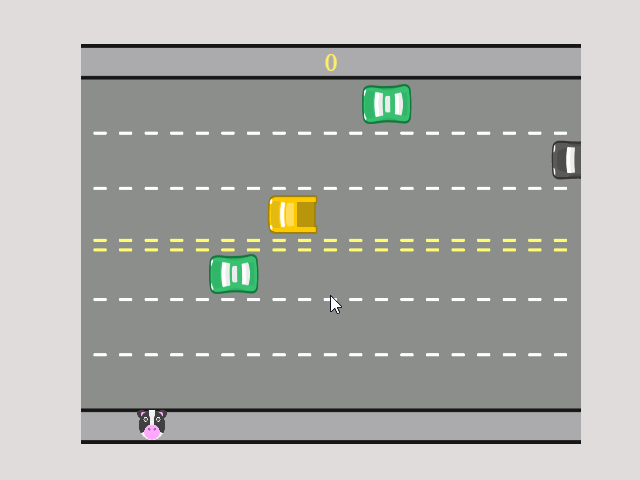

<h1 align="center"> Freewey </h1>

Jogo desenvolvido durante curso de Lógica de programação da Alura para aprimorar habilidades em JavaScript.

  <a href="#-tecnologias">Tecnologias</a>&nbsp;&nbsp;&nbsp;|&nbsp;&nbsp;&nbsp;
  <a href="#-projeto">Projeto</a>&nbsp;&nbsp;&nbsp;|&nbsp;&nbsp;&nbsp;
   <a href="#-">Aprendizado</a>&nbsp;&nbsp;&nbsp;|&nbsp;&nbsp;&nbsp;
  <a href="#memo-licença">Licença</a>

  

 

  

## 🚀 Tecnologias

Esse projeto foi desenvolvido com as seguintes tecnologias:

- HTML e CSS
- JavaScript
- Git e Github

## 💻 Projeto

- [Acesse o projeto finalizado, online](https://freeway-2d-alura-trilhas.vercel.app/)

## 📚 Aprendizado

Aprender a desenvolver um jogo Freeway com JavaScript é uma jornada empolgante que oferece uma introdução prática aos fundamentos da programação e desenvolvimento de jogos. 

 Experimentando erros e sucessos, os aprendizes aprimoram habilidades de resolução de problemas e ganham uma compreensão mais profunda dos princípios subjacentes ao desenvolvimento de software. Ao finalizar o projeto, tenho não apenas um jogo funcional, mas também uma base sólida para explorar áreas mais avançadas da programação e do desenvolvimento de jogos.

## :memo: Licença

Esse projeto está sob a licença MIT.